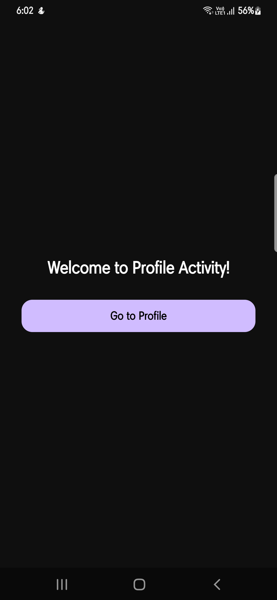
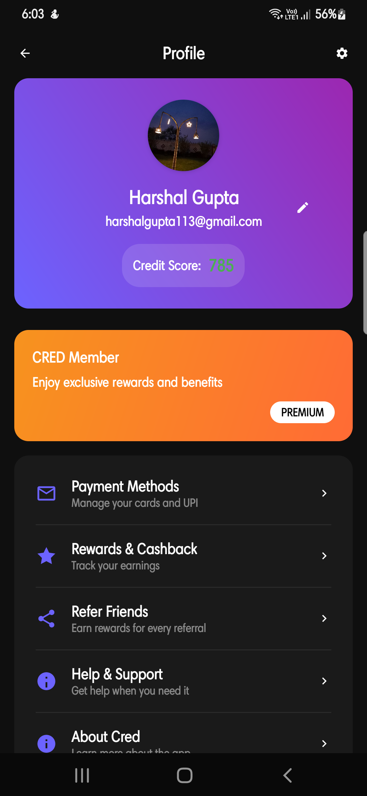

# Profile Activity - Android App

A modern Android application showcasing profile management functionality with a beautiful dark theme UI. This project demonstrates contemporary Android development practices with editable profile fields and image selection capabilities.

## 📱 Features

- **Elegant Profile Management**: View and edit user profile information with a modern UI
- **Image Selection**: Pick profile pictures from gallery with proper permission handling
- **Editable Fields**: Toggle between view and edit modes for name and email fields
- **Credit Score Display**: Showcase credit score with attractive visual design
- **Membership Card**: Beautiful gradient-based membership display
- **Menu Navigation**: Intuitive menu system with various app sections
- **Dark Theme**: Modern dark theme throughout the application
- **Responsive Design**: Optimized for different screen sizes

## 🎨 Design Highlights

- **Material Design**: Follows modern Material Design principles
- **Gradient Backgrounds**: Beautiful gradient-based card designs
- **Interactive Elements**: Smooth animations and feedback for user interactions
- **Card-based Layout**: Clean card-based interface for better organization
- **Professional Typography**: Well-structured text hierarchy

## 📸 Screenshots

### Home Screen



### Profile Screen



## 🚀 Getting Started

### Prerequisites

- Android Studio Arctic Fox or later
- Android SDK 24 or higher
- Java 8 or higher
- Gradle 7.0 or higher

### Installation

1. **Clone the repository**

   ```bash
   git clone https://github.com/harshalgupta113/profile-activity-android.git
   cd profile-activity-android
   ```

2. **Open in Android Studio**

   - Launch Android Studio
   - Click "Open an existing Android Studio project"
   - Navigate to the cloned repository folder
   - Click "OK"

3. **Build the project**
   ```bash
   # For Linux/Mac
   ./gradlew assembleDebug
   
   # For Windows
   .\gradlew.bat assembleDebug
   ```

4. **Run on device/emulator**
   - Connect your Android device or start an emulator
   - Click the "Run" button in Android Studio

### Build APK from Source

To build your own APK from the source code:

```bash
# Clean and build debug APK
.\gradlew.bat clean assembleDebug

# The APK will be generated at:
# app/build/outputs/apk/debug/app-debug.apk
```

## 📱 Download APK

### Direct Download
- **Latest APK**: [Download profile_activity.apk](apk/profile_activity.apk)

### Alternative Download Links
Download the latest APK from the [Releases](https://github.com/harshalgupta113/profile-activity-android/releases) section.

### Installation Instructions

1. Download the APK file from the link above
2. Enable "Unknown Sources" in your Android settings
   - Go to Settings > Security > Unknown Sources (Android 7.0 and below)
   - Go to Settings > Apps > Special access > Install unknown apps (Android 8.0 and above)
3. Open the downloaded APK file
4. Follow the installation prompts
5. Grant necessary permissions when prompted

## 🛠️ Technical Stack

- **Language**: Java
- **UI Framework**: Android Views with XML layouts
- **Architecture**: Traditional Android Activity-based architecture
- **Design**: Material Design Components
- **Image Handling**: Android's built-in image picker
- **Data Storage**: SharedPreferences for user data
- **Permissions**: Runtime permission handling for external storage

## 📂 Project Structure

```
app/
├── src/main/
│   ├── java/com/example/credclone/
│   │   ├── MainActivity.java          # Main landing screen
│   │   └── ProfileActivity.java       # Profile management screen
│   ├── res/
│   │   ├── layout/                    # XML layout files
│   │   ├── drawable/                  # Icons and background drawables
│   │   ├── values/                    # Colors, strings, and dimensions
│   │   └── mipmap/                    # App icons
│   └── AndroidManifest.xml
├── build.gradle.kts                   # App-level build configuration
└── proguard-rules.pro                 # ProGuard configuration
```

## ✨ Key Features Implementation

### Profile Image Selection

- Gallery permission handling
- Image URI management
- Circular profile image display

### Editable Profile Fields

- Toggle edit mode functionality
- Real-time data validation
- SharedPreferences for data persistence

### Modern UI Components

- Custom gradient backgrounds
- Card-based layouts
- Responsive design elements

## 🤝 Contributing

We welcome contributions to improve the Profile Activity app! Here's how you can contribute:

1. **Fork the repository**
2. **Create a feature branch**
   ```bash
   git checkout -b feature/amazing-feature
   ```
3. **Make your changes**
4. **Commit your changes**
   ```bash
   git commit -m 'Add some amazing feature'
   ```
5. **Push to the branch**
   ```bash
   git push origin feature/amazing-feature
   ```
6. **Open a Pull Request**

### Contribution Guidelines

- Follow existing code style and conventions
- Add comments for complex logic
- Update documentation for new features
- Test thoroughly before submitting PR

## 🙏 Acknowledgments

- Material Design guidelines by Google
- Android development community for best practices
- Icons and design elements from Material Design Icons

**Made with ❤️ by [Your Name]**

_Don't forget to ⭐ this repository if you found it helpful!_
